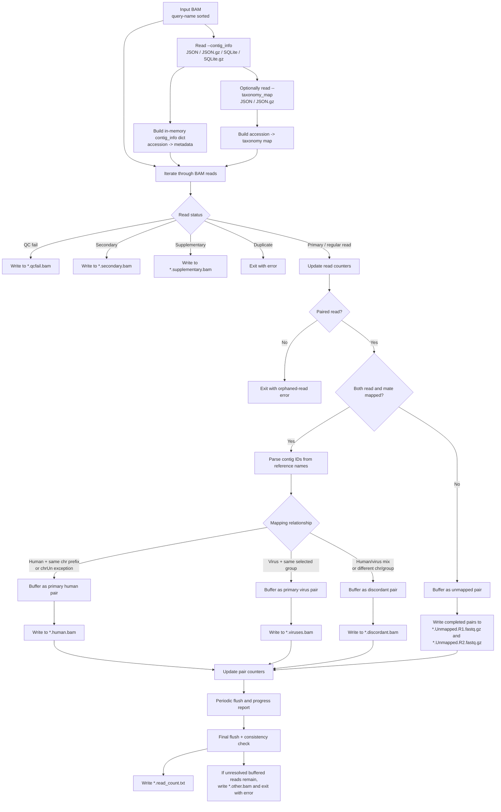

# TaxonomyClassifier.py

## Overview

Classifies reads from a query-name-sorted BAM file into human, virus, discordant, secondary, supplementary, QC-fail, and unmapped outputs.

`TaxonomyClassifier.py` reads a paired-end BAM file and splits alignments into output files based on mapping status and taxonomic origin. The script treats references whose parsed contig name starts with `chr` as human. Non-`chr` references are treated as viral and are looked up in the `contig_info` metadata table to determine the grouping label used for per-virus counting. Viral grouping can use the original `organism`, `ncbitaxon`, or `ncbitaxonname`.



## Requirements

- The `AdVentSeq` conda environment (see the main [README.md](../README.md) for setup). Activate it first: `conda activate AdVentSeq`.
- Input BAM must be sorted by query name.
- This is a standalone script; run it directly with `python TaxonomyClassifier.py ...`.

## Usage

```bash
python TaxonomyClassifier.py \
  --bam <query-name-sorted BAM> \
  --combined_genome <combined genome name> \
  --contig_info <contig_info file> \
  [--taxonomy_map <taxonomy map>] \
  [--virus_group_by organism|ncbitaxon|ncbitaxonname]
```

## Arguments / API

- `--bam`
  Query-name-sorted input BAM file. This argument is required.
- `--combined_genome`
  Name of the combined genome. This argument is required, although the current script only uses it in the missing-argument error path.
- `--contig_info`
  Required contig metadata source. Supported formats are:
  - `.json`
  - `.json.gz`
  - `.db`
  - `.db.gz`
  - `.sqlite.db`
  - `.sqlite.db.gz`
- `--taxonomy_map`
  Optional accession-to-taxonomy mapping in `.json` or `.json.gz` format. Required when `--virus_group_by` is `ncbitaxon` or `ncbitaxonname`.
- `--virus_group_by`
  Viral grouping field. Choices are:
  - `organism` (default)
  - `ncbitaxon`
  - `ncbitaxonname`

### How contig IDs are interpreted

- If a reference name contains pipe-delimited fields, such as `acc|GENBANK|HM118302.1|...`, the script uses the third field as the contig key.
- Otherwise it uses the full reference name directly.
- Human references are identified purely by whether the parsed contig key starts with `chr`.

### Classification rules

- Duplicate reads cause the script to exit immediately with `Duplicate reads found`.
- Reads flagged as QC fail are written to `*.qcfail.bam`.
- Secondary alignments are written to `*.secondary.bam`.
- Supplementary alignments are written to `*.supplementary.bam`.
- Unpaired reads cause the script to exit with an orphaned-read error.
- Reads that are unmapped, or whose mate is unmapped, are collected and written as paired FASTQ files.

For mapped read pairs:

- Human-human pairs are considered primary when both reads map to the same chromosome prefix, for example `chr1` with `chr1_KI270706v1_random`.
- `chrUn...` is treated as an allowed human exception and is still considered primary when paired with another human contig.
- Human-human pairs on different chromosomes are written as discordant.
- Virus-virus pairs are considered primary when both contigs resolve to the same selected viral grouping key.
- In `ncbitaxon` or `ncbitaxonname` mode, missing taxonomy falls back to `organism`.
- Fallback-derived groups are kept separate from taxonomy-resolved groups even when the visible text is identical.
- Virus-virus pairs from different selected groups are written as discordant.
- Human-virus pairs are always written as discordant.

## Inputs

### `contig_info` input format

The script loads `--contig_info` into an in-memory dictionary keyed by accession or contig ID.

For JSON input, the expected structure is:

```json
{
  "HM118273.1": {
    "source": "GENBANK",
    "description": "HIV-1 isolate ...",
    "seqlen": 309,
    "organism": "Human immunodeficiency virus 1"
  }
}
```

For SQLite input, the script expects an RVDB-style database with a table named `rvdb` and a column named `accs`. Rows are loaded into the same dictionary shape used for JSON input. Compressed SQLite files are temporarily decompressed before loading.

### `taxonomy_map` input format

When taxonomy-based grouping is enabled, the script reads `--taxonomy_map` as a JSON object keyed by accession:

```json
{
  "HM118273.1": {
    "ncbitaxon": "11676",
    "ncbitaxonname": "Human immunodeficiency virus 1",
    "organism": "Human immunodeficiency virus 1"
  }
}
```

This file is generated from `--contig_info` by `build_ncbi_taxonomy_map.py`.

## Outputs

The output prefix is derived from the BAM basename using `os.path.splitext(os.path.basename(--bam))[0]`.

For an input BAM named `sample.bam`, the script writes:

- `sample.human.bam`
  Primary human read pairs.
- `sample.viruses.bam`
  Primary viral read pairs.
- `sample.secondary.bam`
  Secondary alignments.
- `sample.supplementary.bam`
  Supplementary alignments.
- `sample.discordant.bam`
  Discordant mapped read pairs.
- `sample.qcfail.bam`
  Reads flagged as QC fail.
- `sample.Unmapped.R1.fastq.gz`
  Unmapped or half-mapped read 1 records.
- `sample.Unmapped.R2.fastq.gz`
  Unmapped or half-mapped read 2 records.
- `sample.read_count.txt`
  Summary counts for total, mapped, unmapped, primary, discordant, human, virus, and per-virus read and pair counts. When fallback is used, fallback-only rows are appended after `#Fallback to organism`.
- `sample.other.bam`
  Only written when the script reaches the final consistency check and still has unresolved reads buffered in memory.

### Read count report

The `*.read_count.txt` report is tab-delimited and includes:

- overall read and pair totals
- QC-fail, mapped, unmapped, secondary, supplementary, primary, and discordant counts
- total human and virus read and pair counts
- one `reads` line and one `pairs` line for each viral organism observed
- when fallback occurs in taxonomy-based grouping modes, fallback-only `reads` and `pairs` lines appear after a separator comment and are not merged into the main per-virus section

## Examples

```bash
python TaxonomyClassifier.py \
  --bam sample.bam \
  --combined_genome combined_genome_name \
  --contig_info sample_data/contig_info.json.gz \
  --taxonomy_map sample_data/ncbi_taxonomy_map.json.gz \
  --virus_group_by ncbitaxonname
```

## Notes / Caveats

- The input BAM must be sorted by query name.
- The script buffers read pairs in memory until both ends are available and flushes completed records periodically.
- Progress is printed to stdout whenever the running total of completed read pairs is divisible by 1,000,000, and again at the end.
- The full `contig_info` dataset is loaded into memory at startup for both JSON and SQLite input modes.
- If `--virus_group_by` is `ncbitaxon` or `ncbitaxonname`, `--taxonomy_map` is required.
- If a viral contig present in the BAM is missing from `contig_info`, the script will raise a lookup error when it tries to count that organism.
- If a viral accession is missing from `--taxonomy_map`, or if the selected taxonomy field is empty, the script falls back to `organism` and records those counts in the fallback-only section.
- Local sample inputs under `sample_data/` are ignored by git.

## Related files

- `build_ncbi_taxonomy_map.py`
  Reads `--contig_info`, queries NCBI using `--email`, and writes a gzipped JSON accession-to-taxonomy map (`--out` defaults to `ncbi_taxonomy_map.json.gz`) suitable for `--taxonomy_map`.
- `convert_rvdb_to_json.py`
  Converts an RVDB SQLite database into a gzipped JSON contig metadata file.
- `ViraQuant.py`
  Quantifies viruses from the same reference mappings.
