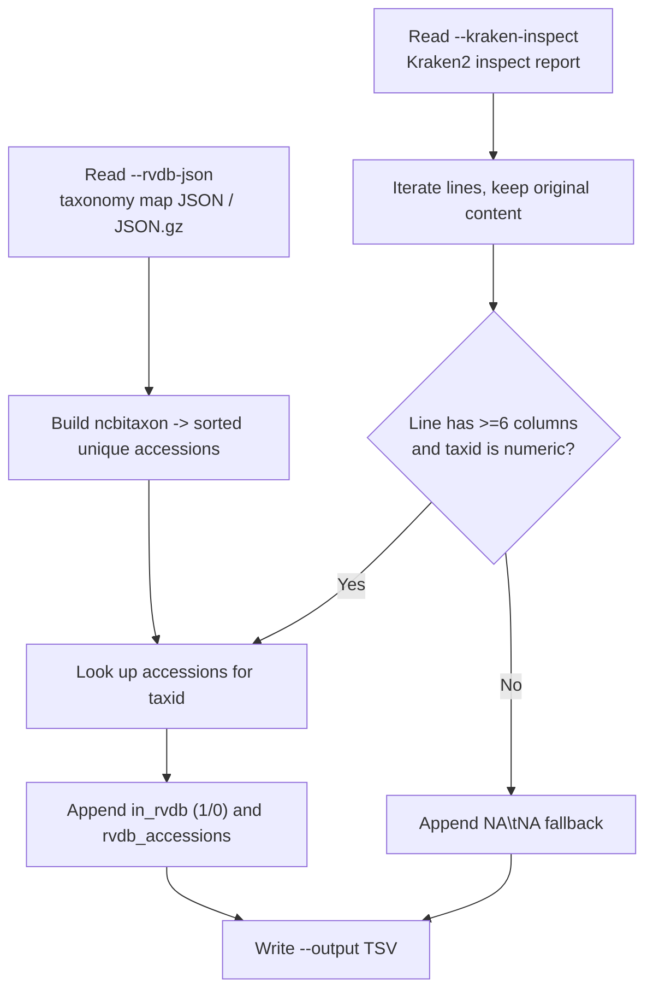

# add_rvdb_columns.py

## Overview

Appends RVDB membership and accession-list columns to a Kraken2 inspect report while preserving its original order and content.

`add_rvdb_columns.py` reads a `kraken2-inspect` report and an accession-keyed RVDB taxonomy mapping (the output of `build_ncbi_taxonomy_map.py`). It builds a `ncbitaxon -> [accessions]` index from the mapping, then walks the inspect report line by line and writes a new TSV with two extra columns: whether the report's taxid is present in RVDB, and the comma-separated RVDB accessions for that taxid. Every original line is passed through unchanged so the report stays aligned with the source.



## Requirements

- The `AdVentSeq` conda environment (see the main [README.md](../README.md) for setup). Activate it first: `conda activate AdVentSeq`.
- This is a standalone script; run it directly with `python add_rvdb_columns.py ...`.

## Usage

```bash
python add_rvdb_columns.py \
  --kraken-inspect <viral.inspect.report> \
  --rvdb-json <taxonomy_map.json[.gz]> \
  --output <out.tsv>
```

## Arguments / API

- `--kraken-inspect`
  Required path to a `kraken2-inspect` output file, for example `viral.inspect.report`.
- `--rvdb-json`
  Required path to an accession-keyed RVDB taxonomy mapping in `.json` or `.json.gz` format (the output of `build_ncbi_taxonomy_map.py`).
- `--output`
  Required path for the output TSV file.

## Inputs

### Kraken2 inspect report

A tab-delimited `kraken2-inspect` report. The script reads the taxid from the 5th column (index 4) of each line with at least 6 columns:

1. `percent`
2. `clade_count`
3. `direct_count`
4. `rank`
5. `taxid`
6. `name`

### RVDB taxonomy mapping

A JSON object keyed by accession, where each value is a record containing an `ncbitaxon` field:

```json
{
  "AB000048.1": {
    "ncbitaxon": "10786",
    "ncbitaxonname": "Feline panleukopenia virus",
    "organism": "Feline panleukopenia virus"
  }
}
```

Only entries whose `ncbitaxon` is a non-empty numeric string are indexed; others are ignored. Accessions are de-duplicated and sorted per taxid.

## Outputs

A TSV file with the original Kraken2 columns plus two appended columns. The header is written as:

```
percent	clade_count	direct_count	rank	taxid	name	in_rvdb	rvdb_accessions
```

Field meanings for the appended columns:

- `in_rvdb`
  `1` if the line's taxid has at least one RVDB accession, otherwise `0`.
- `rvdb_accessions`
  Comma-separated, sorted, unique RVDB accessions for that taxid (empty when none).

## Examples

```bash
python add_rvdb_columns.py \
  --kraken-inspect viral.inspect.report \
  --rvdb-json v31.0/ncbi_taxonomy_map.json.gz \
  --output viral.inspect.with_rvdb.tsv
```

## Notes / Caveats

- The `--rvdb-json` argument is read fully into memory to build the taxid index.
- Both plain and gzipped (`.gz`) RVDB JSON inputs are supported, detected by file extension.
- Lines that are blank are skipped. Lines that do not have at least 6 columns, or whose taxid is not numeric, are still written out but receive `NA\tNA` for the two appended columns, so the line count of the output stays consistent with the meaningful input.

## Related files

- `build_ncbi_taxonomy_map.py`
  Produces the accession-keyed taxonomy mapping consumed via `--rvdb-json`.
- `convert_rvdb_to_json.py`
  Converts RVDB SQLite input into the contig metadata used upstream of the taxonomy mapping.
