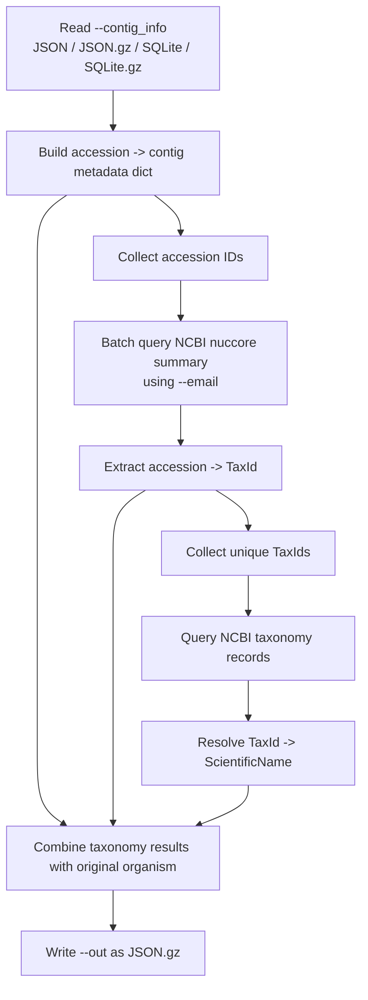

# build_ncbi_taxonomy_map.py

## Overview

Builds a gzipped JSON mapping from accession to NCBI taxonomy ID, NCBI taxonomy name, and the original organism label from `contig_info`.

`build_ncbi_taxonomy_map.py` reads the same contig metadata used by `TaxonomyClassifier.py`, extracts accession IDs, queries NCBI Entrez E-utilities, and writes an accession-keyed taxonomy mapping file that can be consumed by `TaxonomyClassifier.py --taxonomy_map`. The output is designed to support taxonomy-based grouping modes in the classifier while preserving the original `organism` field for fallback reporting.



## Requirements

- The `AdVentSeq` conda environment (see the main [README.md](../README.md) for setup). Activate it first: `conda activate AdVentSeq`.
- Network access to reach NCBI E-utilities.
- This is a standalone script; run it directly with `python build_ncbi_taxonomy_map.py ...`.

## Usage

```bash
python build_ncbi_taxonomy_map.py \
  --contig_info <contig_info file> \
  --email <your email> \
  --out <output.json.gz>
```

## Arguments / API

- `--contig_info`
  Required contig metadata source. Supported formats are:
  - `.json`
  - `.json.gz`
  - `.db`
  - `.db.gz`
  - `.sqlite.db`
  - `.sqlite.db.gz`
- `--email`
  Required email address passed to NCBI E-utilities.
- `--out`
  Optional gzipped JSON output path. Defaults to `ncbi_taxonomy_map.json.gz`.
- `--retry`
  Optional retry count for each failed NCBI request. Defaults to `3`.
- `--prev_map`
  Optional previous taxonomy map (`.json` or `.json.gz`) from an earlier run. Accessions already resolved there are reused instead of re-queried, so only new or previously unresolved accessions hit NCBI. See [Reusing a previous map](#reusing-a-previous-map).

## Inputs

The script reads `--contig_info` into memory as a dictionary keyed by accession.

For JSON input, the expected shape is:

```json
{
  "HM118273.1": {
    "source": "GENBANK",
    "description": "HIV-1 isolate ...",
    "seqlen": 309,
    "organism": "Human immunodeficiency virus 1"
  }
}
```

For SQLite input, the script expects an RVDB-style database with a table named `rvdb` and a column named `accs`.

## Outputs

The output file is a JSON object keyed by accession:

```json
{
  "HM118273.1": {
    "ncbitaxon": "11676",
    "ncbitaxonname": "Human immunodeficiency virus 1",
    "organism": "Human immunodeficiency virus 1"
  }
}
```

Field meanings:

- `ncbitaxon`
  The NCBI taxonomy ID returned for the accession, stored as a string.
- `ncbitaxonname`
  The current scientific name returned from the NCBI taxonomy record for that taxonomy ID.
- `organism`
  The original `organism` value from `contig_info`, preserved for fallback behavior in downstream tools.

## Examples

```bash
python build_ncbi_taxonomy_map.py \
  --contig_info sample_data/contig_info.json.gz \
  --email Binsheng.Gong@fda.hhs.gov \
  --retry 3 \
  --out sample_data/ncbi_taxonomy_map.json.gz
```

## Notes / Caveats

NCBI lookup behavior:

- Accessions are queried in batches against NCBI `nuccore` using `esummary.fcgi`.
- Taxonomy IDs returned from `nuccore` are then resolved to current scientific names using NCBI `taxonomy` via `efetch.fcgi`.
- The script matches returned accessions to the requested keys, including accession-version variants where needed.
- Each network request is retried up to `--retry` times before the script exits with an error.
- Both the `nuccore` phase and the taxonomy phase display progress bars.

Cache and resume behavior:

- The script writes successful batch results into a cache directory derived from `--out`. For example, `ncbi_taxonomy_map.json.gz` uses a sibling cache folder named `ncbi_taxonomy_map.cache`.
- `nuccore` and taxonomy batch results are cached separately.
- Cached batches are reused on rerun, so if the script stops partway through a large job it can resume from the completed batches instead of re-querying everything.
- Only successful batch results are cached.
- The cache directory is deleted automatically after a successful completed run. If the run fails, the cache directory is left in place so the next run can resume from completed batches.

### Reusing a previous map

When `--prev_map` points to an earlier output (for example, the v29.0 map while building v31.0), the script reuses already-retrieved data to avoid re-querying NCBI for the whole database:

- For an accession present in the previous map with a non-null `ncbitaxon`, both `ncbitaxon` and `ncbitaxonname` are copied directly from the previous map (the scientific name is trusted, not refreshed).
- Accessions that are new, or whose previous `ncbitaxon` is `null`/missing, are re-queried against NCBI, since newer NCBI data may now resolve them.
- The `organism` field always comes from the current `--contig_info`, never from the previous map.
- Accessions that exist in the previous map but not in the current `--contig_info` are dropped — the output is always keyed by the current `--contig_info`.
- Taxonomy-name lookups are also skipped for any TaxId already named in the previous map, so even new accessions that resolve to a known TaxId avoid an extra query.

Example, building v31.0 while reusing v29.0:

```bash
python build_ncbi_taxonomy_map.py \
  --contig_info v31.0/contig_info.json.gz \
  --email Binsheng.Gong@fda.hhs.gov \
  --prev_map v29.0/ncbi_taxonomy_map.json.gz \
  --out v31.0/ncbi_taxonomy_map.json.gz
```

Missing data behavior:

- If NCBI returns no taxonomy ID for an accession, the script still writes that accession to the output, with `ncbitaxon` and `ncbitaxonname` written as `null` while `organism` is still copied from `contig_info`.
- This allows `TaxonomyClassifier.py` to fall back to `organism` while keeping those fallback counts separate from true taxonomy-resolved groups.

Other runtime notes:

- The full `contig_info` dataset is loaded into memory before NCBI queries begin.
- The script uses batch size `200` internally for NCBI requests.
- The script prints the output path on success.

## Related files

- `TaxonomyClassifier.py`
  Consumes the generated mapping via `--taxonomy_map`.
- `TaxonomyClassifier.md`
  Documents the classifier's taxonomy-based grouping and fallback reporting.
- `convert_rvdb_to_json.py`
  Converts RVDB SQLite input to a gzipped JSON contig metadata file.
