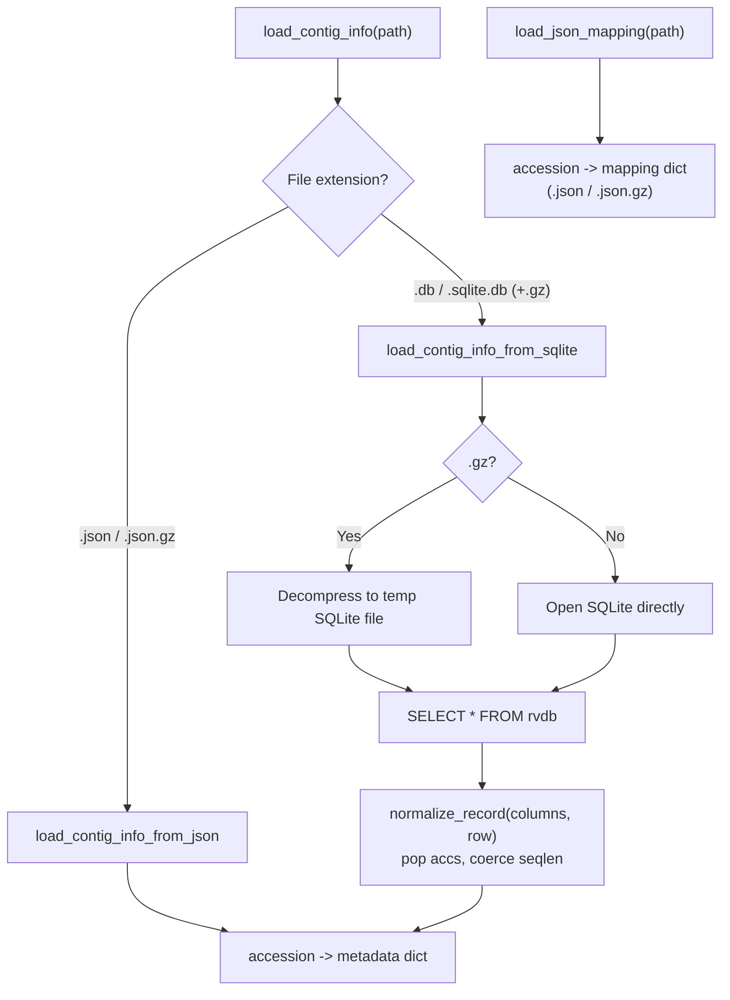

# contig_info_utils.py

## Overview

Shared helpers for loading contig metadata and JSON mappings used across the AdVentSeq tools.

`contig_info_utils.py` is an importable utility module (not a standalone CLI). It centralizes how contig metadata is read from the supported input formats — JSON, gzipped JSON, and RVDB-style SQLite (plain or gzipped) — and how accession-keyed JSON mappings such as the NCBI taxonomy map are loaded. Tools like `build_ncbi_taxonomy_map.py` and `convert_rvdb_to_json.py` import these functions so that format handling and row normalization stay consistent in one place.



## Requirements

- The `AdVentSeq` conda environment (see the main [README.md](../README.md) for setup). Activate it first: `conda activate AdVentSeq`.
- Imported as a module; it is not run directly. Standard library only (`gzip`, `json`, `sqlite3`, `shutil`, `tempfile`, `pathlib`).

## Usage

```python
from AdVentSeq.contig_info_utils import load_contig_info, load_json_mapping

contig_info = load_contig_info("v31.0/contig_info.json.gz")
taxonomy_map = load_json_mapping("v31.0/ncbi_taxonomy_map.json.gz")
```

## Public API

- `normalize_record(columns, row)`
  Zips a SQLite column list and row together, pops `accs` as the accession key, and coerces `seqlen` to an `int` when it is a numeric string. Returns `(accession, record)`.
- `load_contig_info_from_json(path)`
  Loads contig metadata from a `.json` or `.json.gz` file.
- `load_contig_info_from_sqlite_db(path)`
  Reads `SELECT * FROM rvdb` from an open SQLite database file and normalizes each row.
- `load_contig_info_from_sqlite(path)`
  Wrapper that transparently decompresses a `.gz` SQLite archive to a temporary file before reading, then cleans it up.
- `load_contig_info(path)`
  Format-dispatching entry point. Routes to the JSON or SQLite loader based on the file suffix; raises `ValueError` for unsupported extensions.
- `load_json_mapping(path)`
  Loads an accession-keyed JSON mapping (for example, a taxonomy map) from `.json` or `.json.gz`; raises `ValueError` for unsupported extensions.

## Inputs

### Contig metadata (`load_contig_info`)

Supported formats, detected by file suffix:

- `.json`
- `.json.gz`
- `.db`
- `.db.gz`
- `.sqlite.db`
- `.sqlite.db.gz`

For SQLite input, the database must contain a table named `rvdb` with an `accs` column. All other columns become fields of the per-accession record.

### JSON mapping (`load_json_mapping`)

- `.json`
- `.json.gz`

## Outputs

Both `load_contig_info` and `load_json_mapping` return an in-memory `dict` keyed by accession. For contig metadata each value is the normalized record, for example:

```json
{
  "HM118273.1": {
    "source": "GENBANK",
    "description": "HIV-1 isolate ...",
    "seqlen": 309,
    "organism": "Human immunodeficiency virus 1"
  }
}
```

## Notes / Caveats

- Inputs are read fully into memory; these helpers are loaders, not streaming readers. (For streaming SQLite-to-JSON conversion of large RVDB releases, see `convert_rvdb_to_json.py`.)
- Gzipped SQLite input is decompressed to a temporary `.sqlite.db` file, read, and then removed.
- Unsupported file extensions raise a `ValueError` listing the supported formats.

## Related files

- `convert_rvdb_to_json.py`
  Uses `normalize_record` and writes the `contig_info.json.gz` that these loaders read.
- `build_ncbi_taxonomy_map.py`
  Uses `load_contig_info` and `load_json_mapping` to read contig metadata and reuse a previous taxonomy map.
