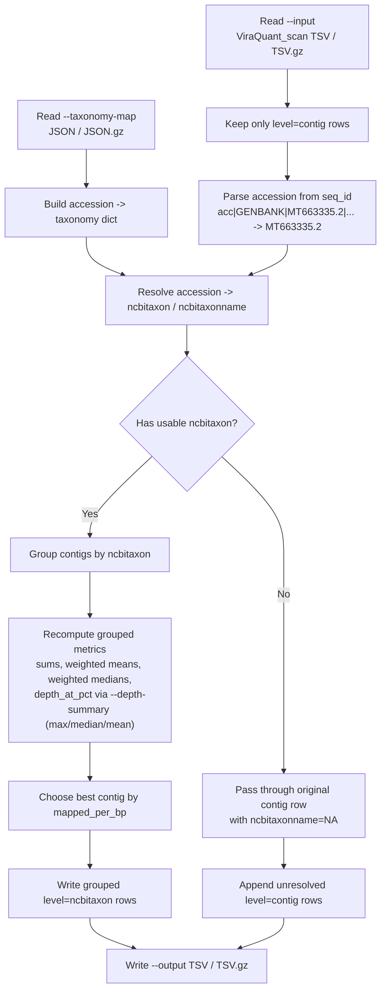

# convert_ViraQuant_scan_to_ncbitaxon.py

## Overview

Converts a `ViraQuant_scan` contig-level TSV into an `ncbitaxon`-grouped summary using an accession-keyed NCBI taxonomy mapping.

`convert_ViraQuant_scan_to_ncbitaxon.py` reads one `ViraQuant_scan.tsv` or `ViraQuant_scan.tsv.gz` file, extracts the accession from each contig `seq_id`, looks that accession up in a taxonomy map, and groups contigs that share the same `ncbitaxon`. The script is designed for post-processing existing `ViraQuant_scan` outputs without going back to BAMs or per-position depth histograms. Because the scan TSV already contains summary statistics rather than raw depth distributions, some grouped metrics are exact recomputations while others are documented TSV-only approximations.



## Requirements

- The `AdVentSeq` conda environment (see the main [README.md](../README.md) for setup). Activate it first: `conda activate AdVentSeq`.
- This is a standalone script; run it directly with `python convert_ViraQuant_scan_to_ncbitaxon.py ...`.
- The converter operates on existing scan TSVs only; it does not reopen BAMs or recompute exact pooled depth distributions.

## Usage

```bash
python convert_ViraQuant_scan_to_ncbitaxon.py \
  --input <ViraQuant_scan.tsv[.gz]> \
  --taxonomy-map <taxonomy_map.json[.gz]> \
  --output <out.tsv[.gz]> \
  [--depth-summary max|median|mean]
```

### Running it as a pipeline step

The `Pipeline` class exposes this converter as an **opt-in** step,
`convert_ViraQuant_scan_to_ncbitaxon`. Call it after a scan-mode
`ViraQuant` run to group that sample's scan TSV by `ncbitaxon`:

```python
p.ViraQuant(scan_by="mean_depth_ge_1>=1", force=force)
p.convert_ViraQuant_scan_to_ncbitaxon(
    taxonomy_map=".../ncbi_taxonomy_map.json.gz", force=force)
```

It writes `<sample>.ViraQuant_scan_ncbitaxon.tsv` next to the raw
`<sample>.ViraQuant_scan.tsv`. The step is **not** baked into `ViraQuant`
because the accession parsing and taxonomy-map schema are RVDB-specific —
other / custom virus databases would need a different grouping step.
`collect_results.py` automatically prefers the grouped
`*.ViraQuant_scan_ncbitaxon.tsv` for its `viraquant_scan_coverage` table and
falls back to the raw scan TSV when the grouped file is absent.

## Arguments / API

- `--input`
  Required input `ViraQuant_scan` table in `.tsv` or `.tsv.gz` format.
- `--taxonomy-map`
  Required accession-keyed taxonomy mapping in `.json` or `.json.gz` format.
- `--output`
  Required output path in `.tsv` or `.tsv.gz` format.
- `--depth-summary`
  Optional. How to summarize the per-contig `depth_at_<pct>pct` coverage-depth columns into the grouped row. One of `max` (default), `median`, or `mean`. See [Choosing a depth summary](#choosing-a-depth-summary) below.

## Inputs

### Input table requirements

The script expects a `ViraQuant_scan`-style tab-delimited table with a header containing at least:

- `level`
- `virus`
- `seq_id`
- `n_contigs`
- `length`
- `mapped_reads`
- `mapped_per_bp`
- `breadth_cov_gt0`
- `mean_depth_all`
- `best_contig_id`
- `best_contig_mapped_per_bp`

Only rows with `level=contig` are used as grouping inputs. Any pre-existing higher-level rows are ignored to avoid double aggregation.

The script also discovers dynamic metric families from the header, including:

- `frac_ge_<n>`
- `mean_depth_ge_<n>`
- `median_depth_ge_<n>`
- `pass_k_<pct>pct_ge_<n>`
- `depth_at_<pct>pct`
- `best_contig_frac_ge_<n>`

This allows it to work with scan files that were generated with non-default `--n-min`, percent, or k-percent settings.

### Taxonomy map format

The taxonomy map must be keyed by accession, not full `seq_id`. Example:

```json
{
  "MT663335.2": {
    "ncbitaxon": "10786",
    "ncbitaxonname": "Feline panleukopenia virus",
    "organism": "Feline panleukopenia virus"
  }
}
```

The script parses `seq_id` using the same accession rule as `TaxonomyClassifier.py`:

- if `seq_id` contains pipe-delimited fields, use the third field
- otherwise use the full `seq_id`

Example:

- `acc|GENBANK|MT663335.2|Mimivirus` -> `MT663335.2`

## Outputs

The output preserves the original `ViraQuant_scan` columns and inserts one additional column:

- `ncbitaxonname`

Two row types may appear:

- `level=ncbitaxon`
  Aggregated rows for contigs with a resolved `ncbitaxon`
- `level=contig`
  Original passthrough rows for contigs that could not be resolved to a usable `ncbitaxon`

For grouped rows:

- `virus` is set to the `ncbitaxon`
- `ncbitaxonname` is filled from the first non-empty mapped taxonomy name for that taxon
- `seq_id` is a comma-separated list of original contig `seq_id` values in input order
- `n_contigs` is the number of grouped contigs

Output order is:

- all resolved `ncbitaxon` rows in first-seen taxon order
- then unresolved passthrough contig rows in original input order

### Metric aggregation rules

**Exact or directly recomputed fields**

- `length` — Sum of grouped contig lengths.
- `mapped_reads` — Sum of grouped contig mapped reads.
- `mapped_per_bp` — `sum(mapped_reads) / sum(length)`.
- `n_contigs` — Count of contigs in the taxon group.
- `breadth_cov_gt0` — Length-weighted mean across grouped contigs.
- `mean_depth_all` — Length-weighted mean across grouped contigs.
- `frac_ge_<n>` — Length-weighted mean across grouped contigs.
- `mean_depth_ge_<n>` — Weighted mean using weight `length * frac_ge_<n>`.
- `pass_k_<pct>pct_ge_<n>` — Recomputed from the grouped `frac_ge_<n>` threshold result.

**TSV-only approximations**

These fields cannot be reconstructed exactly from `ViraQuant_scan` summary rows alone because the scan table does not contain pooled depth histograms:

- `median_depth_ge_<n>` — Approximated as a weighted median of contig medians using weight `length * frac_ge_<n>`.
- `depth_at_<pct>pct` — Summarized across grouped contigs using the method chosen by `--depth-summary` (`max`, `median`, or `mean`). See [Choosing a depth summary](#choosing-a-depth-summary).

Missing values are read as `NA` and are excluded from weighted computations. If no usable values remain for a grouped field, the output is written as `NA`.

### Choosing a depth summary

The `depth_at_<pct>pct` columns report the read depth at which a given fraction of a contig's length is covered, and they drive breadth-based detection downstream (for example, the `depth_at_50pct >= 1` criterion used in the manuscript's fair method comparison). Because a taxon usually groups many contigs of which only one or two carry real signal, the aggregation method strongly affects whether the taxon is counted as detected.

- `max` (default)
  The largest per-contig value (weights ignored). This is the best-contig coverage and is consistent with the best-contig fields. Recommended when the goal is detection: a taxon is reported at the depth of its best-covered contig.
- `median`
  The length-weighted median of contig values. This is the historical behavior. It collapses toward `0` whenever most of the grouped length is uncovered, so taxa with a single well-covered contig often summarize to `0` and drop out of breadth-based detection.
- `mean`
  The length-weighted mean of contig values, emitted as a (possibly fractional) value. More forgiving than `median` but still diluted by uncovered contigs.

Only the `depth_at_<pct>pct` family is affected by this option. Counts, pooled means, `pass_k_*` flags, and best-contig fields are unchanged.

Worked example (Zika virus, taxid 64320, sample `1_S1` HISAT2/bowtie2), where the 12 grouped contigs have per-contig `depth_at_50pct` values `[8, 0, 0, 0, 0, 0, 8, 0, 1, 0, 0, 0]`:

| `--depth-summary` | grouped `depth_at_50pct` | detected at `>= 1`? |
| --- | --- | --- |
| `max` | `8` | yes |
| `median` | `0` | no |
| `mean` | `1.43597` | yes |

### Best-contig fields

Grouped rows keep a detection-oriented best contig, following the same intent as `ViraQuant.py`.

Best contig selection order:

1. highest `mapped_per_bp`
2. if tied, higher `mapped_reads`
3. if still tied, longer `length`
4. if still tied, earlier input order

Grouped best-contig fields are then populated from that chosen row:

- `best_contig_id`
- `best_contig_mapped_per_bp`
- `best_contig_depth_at_90pct`
- any `best_contig_frac_ge_<n>`

## Examples

```bash
python convert_ViraQuant_scan_to_ncbitaxon.py \
  --input Manuscript/Results/ViraQuant_scan/sample.ViraQuant_scan.tsv.gz \
  --taxonomy-map sample_data/ncbi_taxonomy_map.json.gz \
  --output sample.ViraQuant_scan.ncbitaxon.tsv.gz \
  --depth-summary max
```

## Notes / Caveats

- The script loads the full taxonomy map into memory.
- The script reads the full input table once and writes one output table.
- The converter operates on existing scan TSVs only; it does not reopen BAMs or recompute exact pooled depth distributions.
- Missing and conflicting taxonomy behavior:
  - If an accession is missing from the taxonomy map, or if `ncbitaxon` is missing, empty, or `null`, that contig is not grouped.
  - Unresolved contigs remain as original `level=contig` rows.
  - For unresolved passthrough rows, `ncbitaxonname` is written as `NA`.
  - If multiple `ncbitaxonname` values are encountered for the same `ncbitaxon`, the script keeps the first non-empty name and prints one warning to stderr for that taxon.

## Related files

- `ViraQuant.py`
  Generates the contig-level scan summaries that this converter consumes.
- `TaxonomyClassifier.py`
  Uses the same accession parsing rule for taxonomy-based grouping.
- `build_ncbi_taxonomy_map.py`
  Produces accession-keyed taxonomy maps suitable for `--taxonomy-map`.
