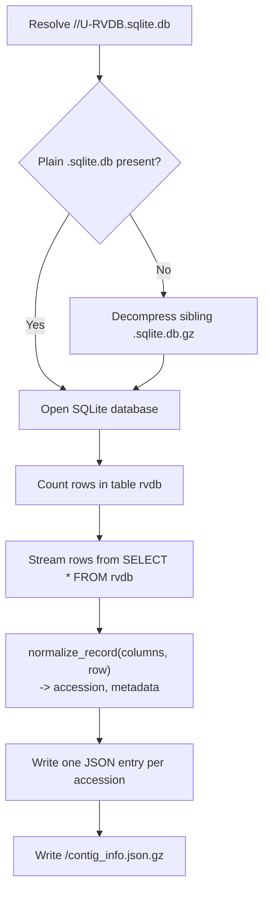

# convert_rvdb_to_json.py

## Overview

Converts an RVDB SQLite database into a gzipped JSON mapping of accession to contig metadata.

`convert_rvdb_to_json.py` reads the `rvdb` table from an RVDB release SQLite database and streams it into a `contig_info.json.gz` file keyed by accession. Rows are normalized with the shared `normalize_record` helper (the same normalization used when loading contig metadata elsewhere), so the resulting JSON is directly consumable by `build_ncbi_taxonomy_map.py` and other tools that take `--contig_info`. Rows are written one at a time directly to the gzip stream, so the full dataset is never held in memory. RVDB: https://rvdb.dbi.udel.edu



## Requirements

- The `AdVentSeq` conda environment (see the main [README.md](../README.md) for setup). Activate it first: `conda activate AdVentSeq`.
- This is a standalone script; run it directly with `python convert_rvdb_to_json.py ...`.

## Usage

```bash
python convert_rvdb_to_json.py \
  [--RVDB_ROOT <rvdb root directory>] \
  <release>
```

## Arguments / API

- `release`
  Required positional argument naming the RVDB release directory to process, for example `v31.0`.
- `--RVDB_ROOT`
  Optional RVDB root directory that contains the release folders. Defaults to the current working directory.

## Inputs

The script expects an RVDB-style SQLite database at:

```
<RVDB_ROOT>/<release>/U-RVDB<release>.sqlite.db
```

If the plain `.sqlite.db` file is absent, the script looks for a sibling `<...>.sqlite.db.gz` and decompresses it in place (the original `.gz` is left untouched). The database must contain a table named `rvdb` with an `accs` column (used as the accession key); all other columns become fields of the per-accession metadata record.

## Outputs

A gzipped JSON object written to:

```
<RVDB_ROOT>/<release>/contig_info.json.gz
```

The object is keyed by accession, with each value holding the remaining normalized columns. For example:

```json
{
  "HM118273.1": {
    "source": "GENBANK",
    "description": "HIV-1 isolate ...",
    "seqlen": 309,
    "organism": "Human immunodeficiency virus 1"
  }
}
```

The script prints the output path on success.

## Examples

```bash
python convert_rvdb_to_json.py --RVDB_ROOT /data/RVDB v31.0
```

This reads `/data/RVDB/v31.0/U-RVDBv31.0.sqlite.db` (decompressing `U-RVDBv31.0.sqlite.db.gz` first if needed) and writes `/data/RVDB/v31.0/contig_info.json.gz`.

## Notes / Caveats

- A progress bar (`Converting <release>`) tracks rows as they are streamed, based on a `SELECT COUNT(*)` taken before the conversion.
- Row normalization is delegated to `normalize_record` in `contig_info_utils.py`, which pops `accs` as the key and coerces `seqlen` to an integer when possible.
- The release directory is created if it does not already exist.

## Related files

- `contig_info_utils.py`
  Provides `normalize_record`, the shared row normalizer, and the loaders that read the generated `contig_info.json.gz`.
- `build_ncbi_taxonomy_map.py`
  Consumes the generated `contig_info.json.gz` via `--contig_info`.
