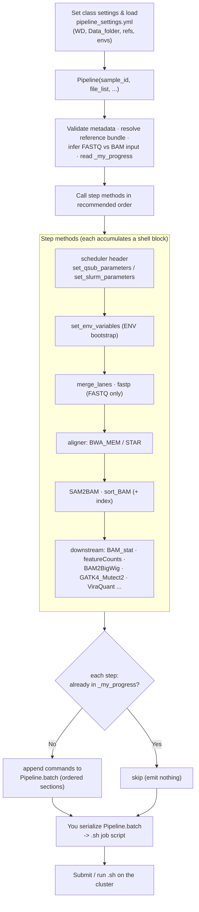

# AdventSeq_Pipeline.py

## Overview

`AdventSeq_Pipeline.py` provides a Python API for building sequencing-analysis batch scripts. Instead of executing tools directly, it accumulates shell commands in an ordered `Pipeline.batch` structure, tracks completed steps through a per-sample progress file, and helps manage reference bundles, Conda environments, and HPC scheduler headers.

This module is best understood as a script generator for reproducible bioinformatics workflows. You create a `Pipeline` object for one sample, call the step methods you want in order, and then serialize the accumulated shell snippets into a `.sh` job script for your cluster or local execution environment. It is the importable core of the package — `from AdventSeq import Pipeline`.

At a high level, the module handles four jobs:

1. Validates sample metadata and input files.
2. Resolves tool environments and reference resources from a `pipeline_settings.yml`-style config.
3. Builds shell command blocks for QC, trimming, alignment, counting, assembly, and downstream analysis.
4. Skips already completed steps by consulting a `_my_progress` file in the sample working directory.

The module does not provide a top-level CLI or a built-in `write_script()` helper. The intended usage pattern is to instantiate `Pipeline`, call the desired methods, and then write out the contents of `pipeline.batch` yourself.



## Requirements

- The `AdventSeq` conda environment with the package installed (see the main [README.md](../README.md) for setup).
- Import the public API from the installed package:

```python
from AdventSeq import Pipeline, list_files_with_extensions, is_valid_DNA_sequence
```

## Usage

For a FASTQ-based sample, a common sequence is:

1. Create the `Pipeline`.
2. Add scheduler header with `set_qsub_parameters()` or `set_slurm_parameters()`.
3. Add bootstrap block with `set_env_variables()`.
4. Optionally call `merge_lanes()`.
5. Optionally call `fastp()`.
6. Align with one mapper such as `BWA_MEM()` or `STAR()`.
7. Convert SAM to BAM with `SAM2BAM()`.
8. Sort and index with `sort_BAM()`.
9. Run downstream steps such as `BAM_stat()`, `featureCounts()`, `BAM2BigWig()`, `GATK4_Mutect2()`, or `ViraQuant()`.

For BAM-based input, FASTQ-only steps such as `MultiQC()` and the aligners are skipped.

### Recommended call order

Because many steps depend on variables set by earlier ones, this order is usually safe:

```text
set_qsub_parameters / set_slurm_parameters
set_env_variables
merge_lanes
fastp
mapper
SAM2BAM
sort_BAM
featureCounts or BAM_stat or other downstream analyses
```

When you change analysis branches, `reset_pipeline()` can be used to create a new round and restore `SID`, the current FASTQ variables, and optionally `ref_genome`. This is useful if you want to start a fresh path from the active FASTQ inputs after an earlier branch.

## Arguments / API

### Public utility functions

- `list_files_with_extensions(folder_path, extensions)`
  Recursively lists files under a folder whose suffix matches one of the requested extensions.
- `is_valid_DNA_sequence(s)`
  Validates that a string contains only `A`, `T`, `C`, and `G`.

(Other module-level helpers such as `parse_gtf` are internal and not exported from the `AdventSeq` package.)

`Pipeline.batch` is a `defaultdict(list)`; Python dicts keep insertion order, so sections are emitted in the order the steps were called. This matters because the generated job script is assembled from ordered blocks such as `HPC`, `ENV`, per-step sections like `sampleA|merge_lanes`, and downstream sections such as alignment, counting, and variant calling.

### Class-level settings

`Pipeline` uses several class attributes as defaults. The most important ones are expected to be set before you create objects:

- `Pipeline.WD` — Root working directory where per-sample output folders will be created.
- `Pipeline.Data_folder` — Required. If unset, object construction exits immediately.
- `Pipeline.threadN` — Number of threads used by many steps. Default is `4`.
- `Pipeline.memory` — Optional memory request used in scheduler headers.
- `Pipeline.adapter` — Optional adapter sequence or paired-end adapter dict.
- `Pipeline.adapter_fasta` — Optional adapter FASTA file used by `fastp`.
- `Pipeline.HPC_nodes_to_use` — Optional allowlist of nodes for SGE jobs.

You can also exclude nodes with `add_nodes_to_be_skipped(more_nodes_to_be_skipped)`.

### Constructor

```python
Pipeline(
    sample_id,
    file_list,
    log_file,
    ref_genome,
    ref_type,
    feature,
    library_source,
    library_layout,
    platform,
    filetype,
)
```

Important constructor arguments:

- `sample_id` — Sample identifier used in filenames, step IDs, and progress tracking.
- `file_list` — Input files for the sample. These are inspected to determine whether the sample is FASTQ or BAM based.
- `log_file` — Scheduler stdout/stderr target.
- `ref_genome` — Logical reference name such as `hg38`. This is also used to look up a reference bundle from YAML.
- `ref_type` — Stored on the object. The code comments suggest values like `genome` or `transcriptome`.
- `feature` — Feature type used by methods like `featureCounts`. Valid values in practice are `transcript`, `exon`, `CDS`, and in one internal check also `genome`.
- `library_source` — Converted to uppercase, for example `GENOMIC` or `TRANSCRIPTOMIC`.
- `library_layout` — Must be `single` or `paired`.
- `platform` — Converted to uppercase and inserted into read group fields, for example `ILLUMINA`.
- `filetype` — Expected input type, usually `fastq` or `bam`. This is cross-checked against the actual file extensions found in `file_list`.

Constructor side effects — during initialization, the object:

- validates `WD` and `Data_folder`
- loads configuration and optional reference paths
- reads `_my_progress` for previously completed steps
- infers raw input type from file suffixes
- builds lane-aware FASTQ metadata for FASTQ samples
- validates adapters if configured

If input file types are mixed or do not match `filetype`, the constructor exits.

### Configuration loading

- `Pipeline.load_pipeline_config(config_path=None)`
  Class method that loads the user YAML config (for `reference_paths`), updates the class-level config cache, and loads `AdventSeq/conda_tools.yml` to refresh both `envs4steps` (derived by inverting each env's `steps:` list) and `conda_tools`.

- `Pipeline.set_conda_tools_config(path)`
  Class method that overrides the bundled `conda_tools.yml` with a custom file. It fully replaces the bundled file (no merge) and immediately reloads it, refreshing both `Pipeline.conda_tools` and `Pipeline.envs4steps`. The same YAML/shape/duplicate-step validation applies. The override persists for the session, so a later `load_pipeline_config()` keeps using the custom file.

`Pipeline` keeps the active YAML path in the class attribute `Pipeline.config_path`. On import, the class default points at the bundled `pipeline_settings.yml.example` (`DEFAULT_ENV_CONFIG`), which ships with the package, while the step &rarr; env mapping comes from the bundled `conda_tools.yml`, so configuration loads out of the box. To switch to your own file for the rest of the session:

```python
Pipeline.load_pipeline_config("/path/to/your_pipeline_settings.yml")
```

That updates all of these class attributes together: `Pipeline.config`, `Pipeline.envs4steps`, `Pipeline.configured_reference_paths`, and `Pipeline.config_path`. If a config path you pass does not exist, the module exits with a message pointing to the matching `.example` file.

### Scheduler helpers

- `set_qsub_parameters()` — Builds an SGE-style script header using `#$` directives, including job name, current working directory, merged stdout/stderr, host include or exclude rules, memory if configured, thread count, and output log path.
- `set_slurm_parameters()` — Builds a Slurm header using `#SBATCH` directives, including job name, output and error file, CPU count, and an optional memory line.
- `set_env_variables()` — Creates the environment/bootstrap section of the generated script. This block sources the conda init script set with `Pipeline.set_conda_init_script()` (if any), defines `SID`, creates and enters `"$WD/$SID"`, and initializes `my_progress`. This is usually one of the first methods you should call after setting scheduler parameters.

### Reference path setters

These methods validate and store reference assets:

- `set_ref_genome(ref_genome)`
- `set_genome_fasta(path)`
- `set_bwa_index(path)`
- `set_bowtie2_index(path)`
- `set_minimap2_index(path)`
- `set_hisat2_index(path)`
- `set_star_index(path)`
- `set_gtf(path)`

If you change `ref_genome` with `set_ref_genome()`, the module clears any currently loaded reference paths and reloads the matching YAML bundle if one exists.

### Step methods

**QC and preprocessing**

- `MultiQC(force=False)` — Runs `fastqc` on raw input files and then aggregates reports with `multiqc`. FASTQ only.
- `merge_lanes(force=False)` — Merges per-lane FASTQ files into a single sample-level FASTQ or paired FASTQ set. If only one lane is present, it simply points the runtime variables at the original files.
- `fastp(dedup=False, trim_adapter=True, trim_polyG=True, trim_polyX=True, force=False)` — Runs `fastp` on the active FASTQ inputs. Supports adapter trimming from either `Pipeline.adapter`, `Pipeline.adapter_fasta`, or `fastp` auto-detection for paired-end data.

**Format conversion and BAM utilities**

- `SAM2BAM(force=False)` — Converts `SAM` to an unsorted BAM file and removes the SAM file afterwards.
- `sort_BAM(force=False, by_qname=False)` — Sorts BAM by coordinate or query name. Coordinate-sorted BAMs are indexed automatically.
- `BAM_stat(force=False)` — Writes a stats report combining selected `samtools view` counts, `samtools flagstat`, and `samtools stats`.
- `BAM_not_in_BED(region, force=False)` — Extracts alignments outside a BED-defined region and creates coverage BED files at multiple coverage thresholds.
- `depth_by_pos(min_MAPQ=1, force=False)` — Generates per-position depth with `samtools depth`.
- `BAM2BigWig(force=False)` — Uses `bamCoverage` to create a normalized BigWig. The scale factor is derived from the assigned read count in `featureCounts` summary output.
- `unmapped_to_fastq()` — Extracts unmapped reads from `BAM` to paired and singleton FASTQ outputs.

**Alignment**

- `BWA_MEM(ref_genome=None, bwa_index=None, SAM=None, force=False)` — Builds a `bwa mem` command with read group tags.
- `Bowtie2(ref_genome=None, bowtie2_index=None, SAM=None, end2end=True, force=False)` — Builds a `bowtie2` command with read groups and optional end-to-end mode.
- `minimap2(ref_genome=None, minimap2_index=None, SAM=None, force=False)` — Builds a `minimap2 -x sr` alignment command for short reads.
- `HISAT2(ref_genome=None, hisat2_index=None, SAM=None, force=False)` — Builds a `hisat2` alignment command with read group tags.
- `STAR(star_index=None, ref_genome=None, gene_model=None, gtf=None, quantification=False, force=False)` — Runs STAR in `alignReads` mode, optionally enabling transcriptome and gene-count quantification. It renames STAR's output SAM to the pipeline's expected `SAM` filename.

All aligners require FASTQ input, set `mapper`, write runtime information into `../runtime.txt`, and update the current step ID because mapping is treated as a critical branch point.

**Host removal and taxonomic analysis**

- `remove_read_pairs_mapped_to_host(force=False)` — Uses samtools to extract paired reads that remain unmapped to the host from `BAM`, writes new FASTQ files, and resets `SID`, `FASTQ_R1`, and `FASTQ_R2` for downstream classification.
- `Kraken2(db_name="standard", kraken2_db_root=None, force=False)` — Runs paired-end Kraken2 classification against the database `<kraken2_db_root>/<db_name>`. `kraken2_db_root` is required.
- `TaxonomyClassifier(contig_info, taxonomy_map=None, virus_group_by=None, force=False)` — Runs the `TaxonomyClassifier` console command against the current BAM.
- `ViraQuant(virus_list=None, top_n=10, scan_by=None, force=False)` — Runs the local `ViraQuant.py` helper against `sorted_BAM`.

**Quantification**

- `featureCounts(gene_model=None, feature=None, countReadPairs=True, saf=None, gtf=None, force=False)` — Runs Subread `featureCounts` using either GTF or SAF annotation. Paired-end libraries automatically use `-p`; `countReadPairs=True` adds `--countReadPairs`; `sorted_by_qname=True` enables `--donotsort`; the output count table is gzipped after generation.

**Assembly and contig-specific analysis**

- `SPAdes(contig, mode="rnaviral", contig_name=None, force=False)` — Extracts properly paired reads from a target contig and assembles them with SPAdes. Internally calls `__BAM_to_proper_paired_FASTQ_of_a_contig(contig, contig_name, force=False)`. Supported SPAdes modes are effectively `rnaviral`, `rna`, or any other value (which falls back to a general careful assembly mode).

**Variant calling**

- `GATK4_Mutect2(ref_genome=None, genome_fasta=None, mode="DNA", no_filter=False, split_multi_allelic=False, force=False)` — Calls variants with `gatk Mutect2`, filters them with `FilterMutectCalls`, and exports a TSV summary with `VariantsToTable`. If `mode == "RNA"`, the generated command adds RNA-oriented options such as `--max-mnp-distance 0` and `--disable-read-filter MateOnSameContigOrNoMappedMateReadFilter`.

### Conda environment tracking

Every step that activates a Conda environment also records that environment name in `Pipeline.required_conda_envs`. You can verify that all required environments exist by calling `check_conda_envs()`, which shells out to `conda env list` and returns any missing environment names.

## Inputs

### Config file (YAML)

The user config (`pipeline_settings.yml`) holds a single top-level section, `reference_paths`:

```yaml
reference_paths:
  hg38:
    genome_fasta: /path/to/hg38.fa
    bwa_index: /path/to/hg38/bwa/prefix
    bowtie2_index: /path/to/hg38/bowtie2/prefix
    minimap2_index: /path/to/hg38.mmi
    hisat2_index: /path/to/hg38/hisat2/prefix
    star_index: /path/to/hg38/star_index
    gtf: /path/to/hg38.gtf
```

The step &rarr; conda-env mapping is **not** in this file. It lives in the bundled
`AdventSeq/conda_tools.yml`, where each env entry declares the steps that run in it:

```yaml
BWA:      {steps: [BWA_MEM], package: bwa, version_cmd: "bwa 2>&1 | grep -i '^Version'"}
samtools: {steps: [SAM2BAM, sort_BAM, BAM_stat, ...], package: samtools, version_cmd: "..."}
gatk:     {steps: [GATK4_Mutect2], package: gatk4, version_cmd: "gatk --version 2>&1 | head -n1"}
```

`Pipeline.envs4steps` (step &rarr; env) is built by inverting those `steps:` lists at load time.

If `ref_genome` is set on the `Pipeline` object and the same key exists in `reference_paths`, the module automatically populates `genome_fasta`, `bwa_index`, `bowtie2_index`, `minimap2_index`, `hisat2_index`, `star_index`, and `gtf`. Each setter validates that the underlying file, directory, or index prefix exists.

### FASTQ naming assumptions

For FASTQ inputs, the module expects filenames that match a pattern based on the sample ID and read number. The internal regex recognizes names containing fields like:

- sample ID
- optional lane or part text
- `R1` / `R2` or `read1` / `read2`
- `.fastq`, `.fq`, and optionally `.gz`

Examples of compatible naming styles:

- `Sample1_L001_R1.fastq.gz`
- `Sample1.read.2.fq.gz`
- `Sample1_laneA_R1.fastq.gz`

If filenames do not match the pattern, initialization exits with an error.

### Internal state worth knowing

Several methods depend on variables created by earlier steps:

- `FASTQ` or `FASTQ_R1` and `FASTQ_R2` — Produced or updated by `merge_lanes()`, `fastp()`, and host-read removal steps.
- `SAM` — Produced by aligners like `BWA_MEM()`, `Bowtie2()`, `minimap2()`, `HISAT2()`, and `STAR()`.
- `BAM` — Produced by `SAM2BAM()`.
- `sorted_BAM` — Produced by `sort_BAM()`.
- `CountRes` — Produced by `featureCounts()` and consumed by `BAM2BigWig()`.
- `mapper` — Set by aligner methods and reused in downstream filenames.
- `ref_genome` — Propagated into many filenames and runtime logs.

This means method order matters. For example, `BAM2BigWig()` assumes `featureCounts()` has already run and populated `CountRes`.

## Outputs

The module's primary output is the in-memory `Pipeline.batch` structure, which you serialize into a `.sh` job script yourself (see [Examples](#examples)).

### Progress tracking and step skipping

Each sample has a progress file at `<WD>/<sample_id>/_my_progress`. Every completed step appends a line containing a step ID and timestamp. When you call a step method:

- if the step is already present in `_my_progress` and `force=False`, the generated commands are commented out instead of removed
- if the step is missing or `force=True`, the commands remain active

This design makes generated scripts easy to inspect while still preserving step history.

## Examples

The following example shows the intended usage pattern for generating a shell script:

```python
from pathlib import Path
from AdventSeq import Pipeline

Pipeline.load_pipeline_config("/path/to/pipeline_settings.yml")

Pipeline.WD = "/path/to/work"
Pipeline.Data_folder = "/path/to/data"
Pipeline.threadN = 16
Pipeline.memory = "64G"

p = Pipeline(
    sample_id="Sample01",
    file_list=[
        "/path/to/data/Sample01_L001_R1.fastq.gz",
        "/path/to/data/Sample01_L001_R2.fastq.gz",
        "/path/to/data/Sample01_L002_R1.fastq.gz",
        "/path/to/data/Sample01_L002_R2.fastq.gz",
    ],
    log_file="/path/to/logs/Sample01.log",
    ref_genome="hg38",
    ref_type="genome",
    feature="exon",
    library_source="TRANSCRIPTOMIC",
    library_layout="paired",
    platform="ILLUMINA",
    filetype="fastq",
)

p.set_qsub_parameters()
p.set_env_variables()
p.merge_lanes()
p.fastp()
p.STAR(ref_genome="hg38", quantification=True)
p.SAM2BAM()
p.sort_BAM()
p.featureCounts()
p.BAM_stat()

script_text = "".join(
    line
    for section_name in p.batch
    for line in p.batch[section_name]
)

Path("Sample01.pipeline.sh").write_text(script_text, encoding="utf-8")
```

If you prefer Slurm, replace `set_qsub_parameters()` with `set_slurm_parameters()`.

## Notes / Caveats

- The module exits with `sys.exit(...)` for most validation failures, so callers should expect hard-stop behavior rather than recoverable exceptions.
- The `TaxonomyClassifier()` and `ViraQuant()` step methods generate commands that invoke the installed `TaxonomyClassifier` and `ViraQuant` console commands, which must be available on `PATH` in the conda env those steps activate.
- `MultiQC()` removes and recreates its output directory before running.
- `fastp()` is written with FASTQ input in mind and is not intended for BAM input.
- There is no built-in method in this file for writing `Pipeline.batch` to disk or submitting jobs automatically.

## Related files

- [AdventSeq_Pipeline.py](AdventSeq_Pipeline.py)
- [pipeline_settings.yml.example](pipeline_settings.yml.example) — bundled default config template.
- [README.md](../README.md) — installation and basic usage.
