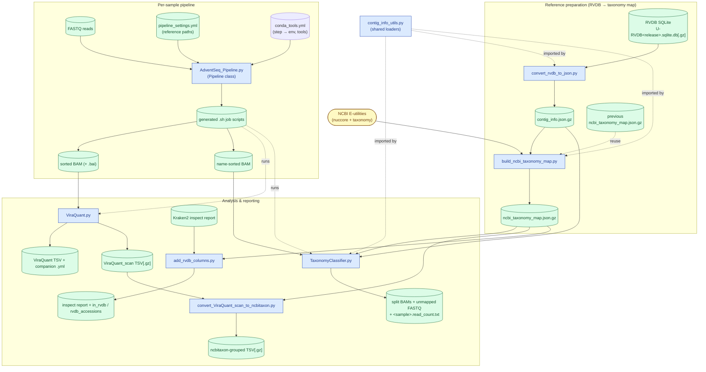

# AdventSeq

AdventSeq is a comprehensive bioinformatics pipeline for detection of adventitious viral agents with
RNA-seq. The `Pipeline` class, importable from the `AdventSeq` Python package, writes one bash job script per sample.
The analysis tools (`ViraQuant`, `TaxonomyClassifier`, `collect-results`, and the helpers) are
installed as console commands.

## Package data flow

The diagram below shows each script in the package, its data files (inputs and outputs), and which
files flow between scripts. Rectangles are scripts/modules, cylinders are data files, and the
rounded node is the external NCBI service. Dashed arrows denote a code dependency (shared module) or
orchestration (generated job scripts running a tool) rather than a data file.



## Installation

AdventSeq needs Python ≥ 3.12 and runs on Linux, macOS, and Windows (through WSL2). The quickest
install uses conda:

```bash
git clone https://github.com/gongbinsheng/AdventSeq.git
cd AdventSeq
conda create -n AdventSeq -c conda-forge python=3.12 -y
conda activate AdventSeq
pip install -e .
```

See [INSTALL.md](INSTALL.md) for step-by-step instructions for each operating system, installing
with uv, and creating the conda envs for the external tools (BWA, samtools, fastp, ...) that the
pipeline steps run in.

## Basic usage

`Pipeline` does not run any tool itself. You create one `Pipeline` object per sample, call its step
methods in order, and write the collected commands (`p.batch`) to a bash job script. The snippet
below runs as-is: it only writes `Sample01.sh`, so the FASTQ paths do not need to exist yet.

```python
from pathlib import Path
from AdventSeq import Pipeline

# Use absolute paths: the job script runs inside the sample's own folder.
data = Path("data").resolve()                   # folder holding the FASTQ files
Pipeline.WD = str(Path("work").resolve())       # per-sample output folders are created here
Pipeline.Data_folder = str(data)
Pipeline.threadN = 4

p = Pipeline(
    sample_id="Sample01",
    file_list=[str(data / "Sample01_R1_001.fastq.gz"), str(data / "Sample01_R2_001.fastq.gz")],
    log_file=str(Path("Sample01.log").resolve()),
    ref_genome="hg38",
    ref_type="genome",
    feature="exon",
    library_source="TRANSCRIPTOMIC",
    library_layout="paired",
    platform="ILLUMINA",
    filetype="fastq",
)
p.set_slurm_parameters()   # job header (#SBATCH lines; plain comments when run with bash)
p.set_env_variables()      # cd into work/Sample01 and set the shell variables
p.MultiQC()                # FastQC + MultiQC on the raw reads
p.merge_lanes()
p.fastp()                  # adapter / quality trimming
# Alignment and later steps need reference files, e.g.:
# p.BWA_MEM(ref_genome="hg38", bwa_index="/path/to/hg38/BWAIndex/genome.fa")
# p.SAM2BAM(); p.sort_BAM(); p.featureCounts(gtf="/path/to/hg38/genes.gtf")

with open("Sample01.sh", "w") as fh:
    for step in p.batch:
        fh.write("".join(p.batch[step]))
```

Steps already recorded as finished in `work/Sample01/_my_progress` are commented out when the
script is regenerated, so re-running a study only repeats unfinished work. For a complete pipeline
(host removal, Kraken2, RVDB scan, targeted virus panel, variant calling) see
[Running the example](#running-the-example).

By default the `Pipeline` loads the bundled `pipeline_settings.yml.example` config. To use your own
environment/reference settings, call `Pipeline.load_pipeline_config("/path/to/your_settings.yml")`
before creating `Pipeline` objects. See [AdventSeq/AdventSeq_Pipeline.md](AdventSeq/AdventSeq_Pipeline.md)
for the full API.

## Conda environments

Each pipeline step runs its tool inside a dedicated conda environment. The step &rarr; env mapping
is defined in `AdventSeq/conda_tools.yml`: each env entry lists the steps that run in it via its
`steps:` field (e.g. env `BWA` has `steps: [BWA_MEM]`), and `Pipeline.envs4steps` is derived by
inverting those lists. The generated job scripts `source` a conda init script and `conda activate`
the relevant env per step.

Point the pipeline at your conda init script before building job scripts. It is usually
`<conda base>/etc/profile.d/conda.sh`; print the base folder with `conda info --base`:

```python
Pipeline.set_conda_init_script("/path/to/miniforge3/etc/profile.d/conda.sh")
```

To use your own env names / tool definitions instead of the bundled `conda_tools.yml`, point the
pipeline at a custom copy (it fully replaces the bundled file and immediately refreshes the
step &rarr; env mapping):

```python
Pipeline.set_conda_tools_config("/path/to/your_conda_tools.yml")
```

When `Pipeline.load_pipeline_config(...)` loads a config it also, by default:

1. **Verifies every conda env exists.** If any are missing, it writes an `install_conda_envs.sh`
   next to your config (using the `conda-forge` and `bioconda` channels) and exits so you can review
   and run it:

   ```bash
   bash install_conda_envs.sh   # review first, then re-run your pipeline
   ```

2. **Records the main tool version for each env** into a timestamped, commented block at the end of
   the config yml (the block is fully commented, so it does not affect parsing):

   ```yaml
   # >>> AdventSeq tool versions >>>
   # generated: 20260622_110729[CDT]
   # BWA: Version: 0.7.17-r1188
   # samtools: samtools 1.17
   # <<< AdventSeq tool versions <<<
   ```

   If a versions block already exists you are prompted to **update**, **skip** (default), or
   **quit**. Pass `on_existing_versions="update" | "skip" | "quit"` to skip the prompt.

The step list, install package name, and version command for each env live in the bundled
`AdventSeq/conda_tools.yml` data file (env names often differ from package names, e.g. `BWA` &rarr;
`bwa`, `gatk` &rarr; `gatk4`). Edit that file if bioconda/conda-forge package names or version flags
change, or to reassign which env a step runs in.

If your environments are already set up and recorded, skip both checks:

```python
Pipeline.load_pipeline_config("/path/to/your_settings.yml", check_conda_setup=False)
```

The analysis tools are installed as console commands and can be run from any directory once the
environment is active:

```bash
conda activate AdventSeq
ViraQuant --help
TaxonomyClassifier --help
```

## Running the example

The [`examples/`](examples) folder contains everything needed to run the full pipeline on your own
paired-end RNA-seq data, except the FASTQ files and the reference data, which are too large for the
repository. Their folders hold placeholder `README.md` files; prepare the data as described below.

```text
examples/
├── SRA_metadata_example.xlsx          # study metadata template (sheet "SRA_data"), one row per sample
├── create_pipeline_script_example.py  # builds one job script per sample + submit.sh
├── run_example.sh                     # generate the job scripts, then run them
├── collect_results_example.sh         # collect all samples' outputs into tables
├── pipeline_settings.yml              # pipeline config (tool versions are recorded here)
├── conda_tools.yml                    # conda envs used by the example
├── host_gene_families_example.yml     # host-gene panel for collect-results --host-genes
├── data/fastq/                        # PLACEHOLDER: your FASTQ files (step 1)
└── references/                        # reference data (step 2)
    ├── hg38/                          # PLACEHOLDER: host genome, GTF, BWA index
    ├── Kraken2DB/                     # PLACEHOLDER: Kraken2 viral database
    ├── RVDB/v29.0/                    # PLACEHOLDER: RVDB sequences, BWA index, taxonomy map
    └── virus_panel/                   # virus panel: list + metadata included, FASTA downloaded
```

Each sample goes through: FastQC/MultiQC → fastp trimming → BWA-MEM to hg38 → featureCounts (host
genes) → removal of host read pairs → Kraken2 → BWA-MEM to RVDB → TaxonomyClassifier + ViraQuant
scan (grouped to NCBI taxa) → BWA-MEM to the virus panel → TaxonomyClassifier + ViraQuant →
GATK4 Mutect2.

Before you start, install AdventSeq and the tool envs ([INSTALL.md](INSTALL.md), Option A). Run all
commands below from the repository root with the `AdventSeq` env active:

```bash
conda activate AdventSeq
```

### Step 1: FASTQ data

FASTQ files are not provided; test the pipeline with your own paired-end RNA-seq data.

1. Copy (or symlink) your FASTQ files into `examples/data/fastq/`.
2. Describe the samples in the `SRA_data` sheet of `examples/SRA_metadata_example.xlsx`, one row
   per sample. The four rows in the template (`A01_S1` … `A04_S4`) only show the format; replace
   them with your samples. The columns used are:

   | Column | Content |
   | --- | --- |
   | `library_ID` | sample ID, used in all output file names |
   | `title` | sample title shown in the collected tables |
   | `library_source` | e.g. `TRANSCRIPTOMIC` |
   | `library_layout` | `paired` |
   | `platform` | e.g. `ILLUMINA` |
   | `filetype` | `fastq` |
   | `filename1`, `filename2`, … | the sample's FASTQ file names (not paths) |

Each file name must start with the sample's `library_ID` and contain the read number, e.g.
`<library_ID>_R1_001.fastq.gz` and `<library_ID>_R2_001.fastq.gz`. Files from several lanes
(`..._L001_R1_...`, `..._L002_R1_...`) are merged automatically.

### Step 2: Reference data

The commands below download the references into `examples/references/` and index them with the
tool envs from INSTALL.md (`conda run -n <env>` runs a command in an env without activating it).
Indexing the human genome and RVDB with BWA needs about 16 GB of RAM and can take a few hours.

```bash
REF=examples/references
```

**Host genome (hg38)**: UCSC genome, NCBI RefSeq gene annotation, and BWA index:

```bash
curl -L https://hgdownload.soe.ucsc.edu/goldenPath/hg38/bigZips/hg38.fa.gz | gunzip -c > $REF/hg38/hg38.fa
curl -L https://hgdownload.soe.ucsc.edu/goldenPath/hg38/bigZips/genes/hg38.ncbiRefSeq.gtf.gz | gunzip -c > $REF/hg38/hg38.ncbiRefSeq.gtf
mkdir -p $REF/hg38/BWAIndex
conda run -n BWA bwa index -p $REF/hg38/BWAIndex/genome.fa $REF/hg38/hg38.fa
```

**Kraken2 viral database**: pre-built index from the
[Kraken2 index collection](https://benlangmead.github.io/aws-indexes/k2):

```bash
mkdir -p $REF/Kraken2DB/viral
curl -L https://genome-idx.s3.amazonaws.com/kraken/k2_viral_20240904.tar.gz | tar -xzf - -C $REF/Kraken2DB/viral
```

**RVDB v29.0**: the [Reference Viral Database](https://rvdb.dbi.udel.edu). The clustered sequences
are used for alignment, and the annotation database is used for contig metadata. The NCBI taxonomy
map is then built from the annotation. Pass your own e-mail address, as NCBI requires.

> **Building the RVDB taxonomy map takes hours.** `build-ncbi-taxonomy-map` queries NCBI
> E-utilities for every RVDB accession, so expect it to run for several hours. Finished NCBI
> batches are cached in `ncbi_taxonomy_map.cache/` next to the output, so if the run is
> interrupted, running the same command again resumes where it stopped (see
> [AdventSeq/build_ncbi_taxonomy_map.md](AdventSeq/build_ncbi_taxonomy_map.md)).


```bash
RVDB=$REF/RVDB/v29.0
curl -L -o $RVDB/C-RVDBv29.0.fasta.gz https://rvdb.dbi.udel.edu/download/C-RVDBv29.0.fasta.gz
curl -L -o $RVDB/U-RVDBv29.0.sqlite.db.gz https://rvdb.dbi.udel.edu/download/U-RVDBv29.0.sqlite.db.gz
mkdir -p $RVDB/BWAIndex
conda run -n BWA bwa index -p $RVDB/BWAIndex/C-RVDB.fa $RVDB/C-RVDBv29.0.fasta.gz
convert-rvdb-to-json --RVDB_ROOT $REF/RVDB v29.0          # writes $RVDB/contig_info.json.gz
build-ncbi-taxonomy-map \
  --contig_info $RVDB/contig_info.json.gz \
  --email your.name@example.org \
  --out $RVDB/ncbi_taxonomy_map.json.gz
```

**Virus panel**: a small panel of seven viral RefSeq genomes that are common adventitious agents of
biological products and cell substrates: porcine circovirus 1 and 2, minute virus of mice, bovine
viral diarrhea virus 1, simian virus 40, human adenovirus 5, and Moloney murine leukemia virus. The
accession list (`accessions.txt`), the ViraQuant virus list (`virus_list.txt`), and the contig
metadata (`contig_info.json`) are included; see
[examples/references/virus_panel/README.md](examples/references/virus_panel/README.md) to use other
viruses. Download the genomes and build the BWA, samtools, and GATK indexes:

```bash
V=$REF/virus_panel
curl -L "https://eutils.ncbi.nlm.nih.gov/entrez/eutils/efetch.fcgi?db=nuccore&rettype=fasta&retmode=text&id=$(paste -sd, $V/accessions.txt)" > $V/viruses.fa
mkdir -p $V/BWAIndex
conda run -n BWA bwa index -p $V/BWAIndex/viruses.fa $V/viruses.fa
conda run -n samtools samtools faidx $V/viruses.fa
conda run -n gatk gatk CreateSequenceDictionary -R $V/viruses.fa -O $V/viruses.dict
```

### Step 3: Run the pipeline

```bash
bash examples/run_example.sh
```

The script first checks that every FASTQ and reference file is in place and lists any that are
missing. It then writes one job script per sample to `examples/Results/__jobs/` and runs the
samples one after another. Each sample's log is in `examples/Results/__log/<sample>.log`, and its
outputs are in `examples/Results/<sample>/`. Set the number of threads with
`THREADS=8 bash examples/run_example.sh`. On a Slurm cluster, `bash examples/run_example.sh slurm`
submits one job per sample with `sbatch` instead.

Running the script again skips the steps that have already finished (they are listed in
`examples/Results/<sample>/_my_progress`). To only generate the job scripts, run
`python examples/create_pipeline_script_example.py --help` for the options.

### Step 4: Collect the results

After all samples have finished:

```bash
bash examples/collect_results_example.sh
```

This writes the consolidated tables to `examples/Collected_Tables/`: TSV files, the workbook
`AdventSeq_results.xlsx` (with a CPM-normalized companion workbook), and the interactive coverage
tables `viraquant_targeted_interactive.html` and `viraquant_scan_topn_interactive.html`, which open
in any web browser. See [AdventSeq/collect_results.md](AdventSeq/collect_results.md) for a
description of each table.

## Documentation

### Package (importable)

- `AdventSeq/AdventSeq_Pipeline.py` (the `Pipeline` class) — see
  [AdventSeq/AdventSeq_Pipeline.md](AdventSeq/AdventSeq_Pipeline.md)

### Analysis tools (console commands)

- `ViraQuant` (`AdventSeq/ViraQuant.py`) — see [AdventSeq/ViraQuant.md](AdventSeq/ViraQuant.md)
- `TaxonomyClassifier` (`AdventSeq/TaxonomyClassifier.py`) — see [AdventSeq/TaxonomyClassifier.md](AdventSeq/TaxonomyClassifier.md)
- `collect-results` (`AdventSeq/collect_results.py`) — collect per-sample pipeline
  outputs into consolidated tables (+ an interactive coverage table); see
  [AdventSeq/collect_results.md](AdventSeq/collect_results.md)
- `build-ncbi-taxonomy-map` (`AdventSeq/build_ncbi_taxonomy_map.py`) — see [AdventSeq/build_ncbi_taxonomy_map.md](AdventSeq/build_ncbi_taxonomy_map.md)
- `convert-ViraQuant-scan-to-ncbitaxon` (`AdventSeq/convert_ViraQuant_scan_to_ncbitaxon.py`) — group a
  ViraQuant scan TSV to `ncbitaxon` level (RVDB-specific). Also available as the opt-in pipeline step
  `Pipeline.convert_ViraQuant_scan_to_ncbitaxon`, called after a scan-mode `ViraQuant`; `collect-results`
  then prefers the grouped output. See
  [AdventSeq/convert_ViraQuant_scan_to_ncbitaxon.md](AdventSeq/convert_ViraQuant_scan_to_ncbitaxon.md)
- `convert-rvdb-to-json` (`AdventSeq/convert_rvdb_to_json.py`) — see [AdventSeq/convert_rvdb_to_json.md](AdventSeq/convert_rvdb_to_json.md)
- `add-rvdb-columns` (`AdventSeq/add_rvdb_columns.py`) — see [AdventSeq/add_rvdb_columns.md](AdventSeq/add_rvdb_columns.md)
