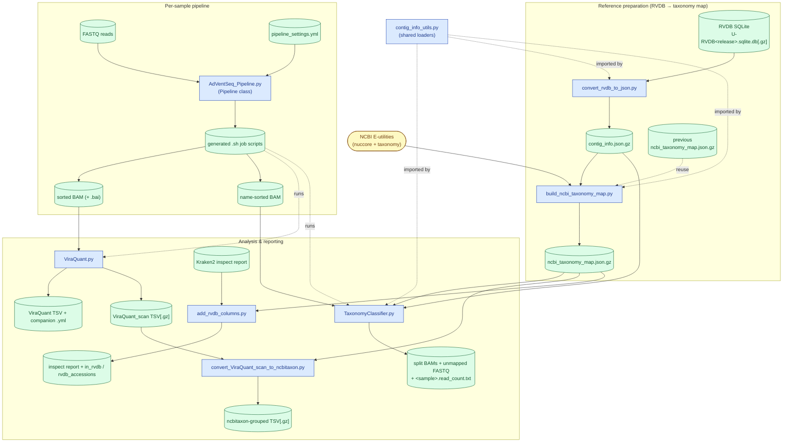

# AdVentSeq

AdVentSeq is an HPC pipeline builder and viral-quantification toolkit for sequencing data. The
`Pipeline` class is provided as an importable Python package, while the analysis tools
(`ViraQuant.py`, `TaxonomyClassifier.py`, and the helpers) are standalone scripts.

## Package data flow

The diagram below shows each script in the package, its data files (inputs and outputs), and which
files flow between scripts. Rectangles are scripts/modules, cylinders are data files, and the
rounded node is the external NCBI service. Dashed arrows denote a code dependency (shared module) or
orchestration (generated job scripts running a tool) rather than a data file.



## Installation

AdVentSeq targets Python 3.12. Create a dedicated conda environment and install the package in
editable mode:

```bash
conda create -n AdVentSeq python=3.12 -y
conda activate AdVentSeq
pip install -e .
```

This installs the importable `AdVentSeq` package (the `Pipeline` class) along with its runtime
dependencies (`pysam`, `tqdm`, `pyyaml`). It also registers the analysis tools as console commands
(`ViraQuant`, `TaxonomyClassifier`, etc.) on your `PATH`, so they can be run from any directory
while the environment is active.

## Basic usage

Import the package:

```python
import AdVentSeq as AVS
from AdVentSeq import Pipeline, list_files_with_extensions, is_valid_DNA_sequence

# Configure class-level settings, then build a per-sample job script.
Pipeline.WD = "/path/to/work"
Pipeline.Data_folder = "/path/to/data"

p = Pipeline(
    sample_id="Sample01",
    file_list=["/path/to/data/Sample01_L001_R1.fastq.gz",
               "/path/to/data/Sample01_L001_R2.fastq.gz"],
    log_file="/path/to/logs/Sample01.log",
    ref_genome="hg38",
    ref_type="genome",
    feature="exon",
    library_source="TRANSCRIPTOMIC",
    library_layout="paired",
    platform="ILLUMINA",
    filetype="fastq",
)
p.set_qsub_parameters()
p.set_env_variables()
# ... call step methods, then serialize p.batch to a .sh script.
```

By default the `Pipeline` loads the bundled `pipeline_settings.yml.example` config. To use your own
environment/reference settings, call `Pipeline.load_pipeline_config("/path/to/your_settings.yml")`
before creating `Pipeline` objects. See [AdVentSeq/AdVentSeq_Pipeline.md](AdVentSeq/AdVentSeq_Pipeline.md)
for the full API.

The analysis tools are installed as console commands and can be run from any directory once the
environment is active:

```bash
conda activate AdVentSeq
ViraQuant --help
TaxonomyClassifier --help
```

## Documentation

### Package (importable)

- `AdVentSeq/AdVentSeq_Pipeline.py` (the `Pipeline` class) — see
  [AdVentSeq/AdVentSeq_Pipeline.md](AdVentSeq/AdVentSeq_Pipeline.md)

### Analysis tools (console commands)

- `ViraQuant` (`AdVentSeq/ViraQuant.py`) — see [AdVentSeq/ViraQuant.md](AdVentSeq/ViraQuant.md)
- `TaxonomyClassifier` (`AdVentSeq/TaxonomyClassifier.py`) — see [AdVentSeq/TaxonomyClassifier.md](AdVentSeq/TaxonomyClassifier.md)
- `build-ncbi-taxonomy-map` (`AdVentSeq/build_ncbi_taxonomy_map.py`) — see [AdVentSeq/build_ncbi_taxonomy_map.md](AdVentSeq/build_ncbi_taxonomy_map.md)
- `convert-ViraQuant-scan-to-ncbitaxon` (`AdVentSeq/convert_ViraQuant_scan_to_ncbitaxon.py`) — see
  [AdVentSeq/convert_ViraQuant_scan_to_ncbitaxon.md](AdVentSeq/convert_ViraQuant_scan_to_ncbitaxon.md)
- `convert-rvdb-to-json` (`AdVentSeq/convert_rvdb_to_json.py`)
- `add-rvdb-columns` (`AdVentSeq/add_rvdb_columns.py`)
