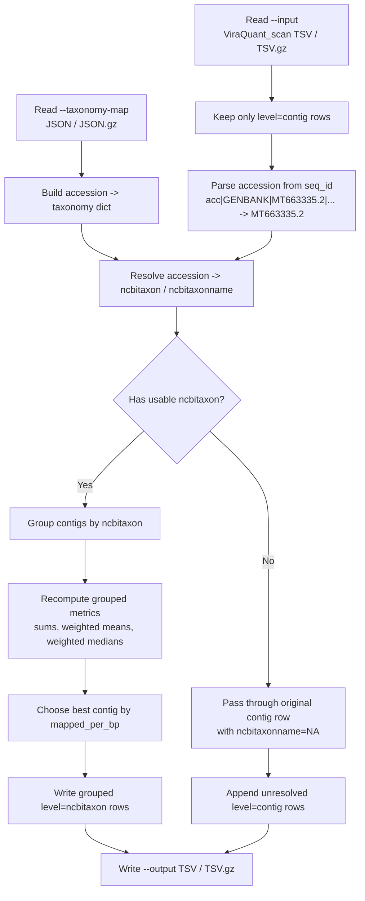

# convert_viraquant_scan_to_ncbitaxon.py

Converts a `ViraQuant_scan` contig-level TSV into an `ncbitaxon`-grouped summary using an accession-keyed NCBI taxonomy mapping.

## Purpose

`convert_viraquant_scan_to_ncbitaxon.py` reads one `ViraQuant_scan.tsv` or `ViraQuant_scan.tsv.gz` file, extracts the accession from each contig `seq_id`, looks that accession up in a taxonomy map, and groups contigs that share the same `ncbitaxon`.

The script is designed for post-processing existing `ViraQuant_scan` outputs without going back to BAMs or per-position depth histograms. Because the scan TSV already contains summary statistics rather than raw depth distributions, some grouped metrics are exact recomputations while others are documented TSV-only approximations.

## Workflow and data flow



## Command line arguments

- `--input`
  Required input `ViraQuant_scan` table in `.tsv` or `.tsv.gz` format.
- `--taxonomy-map`
  Required accession-keyed taxonomy mapping in `.json` or `.json.gz` format.
- `--output`
  Required output path in `.tsv` or `.tsv.gz` format.

Example:

```bash
uv run python convert_viraquant_scan_to_ncbitaxon.py \
  --input Manuscript/Results/ViraQuant_scan/sample.ViraQuant_scan.tsv.gz \
  --taxonomy-map sample_data/ncbi_taxonomy_map.json.gz \
  --output sample.ViraQuant_scan.ncbitaxon.tsv.gz
```

## Input table requirements

The script expects a `ViraQuant_scan`-style tab-delimited table with a header containing at least:

- `level`
- `virus`
- `seq_id`
- `n_contigs`
- `length`
- `mapped_reads`
- `mapped_per_bp`
- `breadth_cov_gt0`
- `mean_depth_all`
- `best_contig_id`
- `best_contig_mapped_per_bp`

Only rows with `level=contig` are used as grouping inputs. Any pre-existing higher-level rows are ignored to avoid double aggregation.

The script also discovers dynamic metric families from the header, including:

- `frac_ge_<n>`
- `mean_depth_ge_<n>`
- `median_depth_ge_<n>`
- `pass_k_<pct>pct_ge_<n>`
- `depth_at_<pct>pct`
- `best_contig_frac_ge_<n>`

This allows it to work with scan files that were generated with non-default `--n-min`, percent, or k-percent settings.

## Taxonomy map format

The taxonomy map must be keyed by accession, not full `seq_id`. Example:

```json
{
  "MT663335.2": {
    "ncbitaxon": "10786",
    "ncbitaxonname": "Feline panleukopenia virus",
    "organism": "Feline panleukopenia virus"
  }
}
```

The script parses `seq_id` using the same accession rule as `taxonomic_classifier.py`:

- if `seq_id` contains pipe-delimited fields, use the third field
- otherwise use the full `seq_id`

Example:

- `acc|GENBANK|MT663335.2|Mimivirus` -> `MT663335.2`

## Output format

The output preserves the original `ViraQuant_scan` columns and inserts one additional column:

- `ncbitaxonname`

Two row types may appear:

- `level=ncbitaxon`
  Aggregated rows for contigs with a resolved `ncbitaxon`
- `level=contig`
  Original passthrough rows for contigs that could not be resolved to a usable `ncbitaxon`

For grouped rows:

- `virus` is set to the `ncbitaxon`
- `ncbitaxonname` is filled from the first non-empty mapped taxonomy name for that taxon
- `seq_id` is a comma-separated list of original contig `seq_id` values in input order
- `n_contigs` is the number of grouped contigs

Output order is:

- all resolved `ncbitaxon` rows in first-seen taxon order
- then unresolved passthrough contig rows in original input order

## Metric aggregation rules

### Exact or directly recomputed fields

- `length`
  Sum of grouped contig lengths.
- `mapped_reads`
  Sum of grouped contig mapped reads.
- `mapped_per_bp`
  `sum(mapped_reads) / sum(length)`.
- `n_contigs`
  Count of contigs in the taxon group.
- `breadth_cov_gt0`
  Length-weighted mean across grouped contigs.
- `mean_depth_all`
  Length-weighted mean across grouped contigs.
- `frac_ge_<n>`
  Length-weighted mean across grouped contigs.
- `mean_depth_ge_<n>`
  Weighted mean using weight `length * frac_ge_<n>`.
- `pass_k_<pct>pct_ge_<n>`
  Recomputed from the grouped `frac_ge_<n>` threshold result.

### TSV-only approximations

These fields cannot be reconstructed exactly from `ViraQuant_scan` summary rows alone because the scan table does not contain pooled depth histograms:

- `median_depth_ge_<n>`
  Approximated as a weighted median of contig medians using weight `length * frac_ge_<n>`.
- `depth_at_<pct>pct`
  Approximated as a length-weighted median of contig values.

Missing values are read as `NA` and are excluded from weighted computations. If no usable values remain for a grouped field, the output is written as `NA`.

## Best-contig fields

Grouped rows keep a detection-oriented best contig, following the same intent as `ViraQuant.py`.

Best contig selection order:

1. highest `mapped_per_bp`
2. if tied, higher `mapped_reads`
3. if still tied, longer `length`
4. if still tied, earlier input order

Grouped best-contig fields are then populated from that chosen row:

- `best_contig_id`
- `best_contig_mapped_per_bp`
- `best_contig_depth_at_90pct`
- any `best_contig_frac_ge_<n>`

## Missing and conflicting taxonomy behavior

- If an accession is missing from the taxonomy map, or if `ncbitaxon` is missing, empty, or `null`, that contig is not grouped.
- Unresolved contigs remain as original `level=contig` rows.
- For unresolved passthrough rows, `ncbitaxonname` is written as `NA`.
- If multiple `ncbitaxonname` values are encountered for the same `ncbitaxon`, the script keeps the first non-empty name and prints one warning to stderr for that taxon.

## Runtime behavior and assumptions

- The script loads the full taxonomy map into memory.
- The script reads the full input table once and writes one output table.
- The converter operates on existing scan TSVs only; it does not reopen BAMs or recompute exact pooled depth distributions.
- This project uses `uv` for Python commands. Run the script with `uv run python ...`.

## Related files

- `convert_viraquant_scan_to_ncbitaxon.py`
  The converter described in this document.
- `ViraQuant.py`
  Generates the contig-level scan summaries that this converter consumes.
- `taxonomic_classifier.py`
  Uses the same accession parsing rule for taxonomy-based grouping.
- `build_ncbi_taxonomy_map.py`
  Produces accession-keyed taxonomy maps suitable for `--taxonomy-map`.
